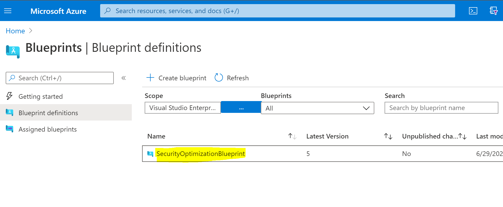
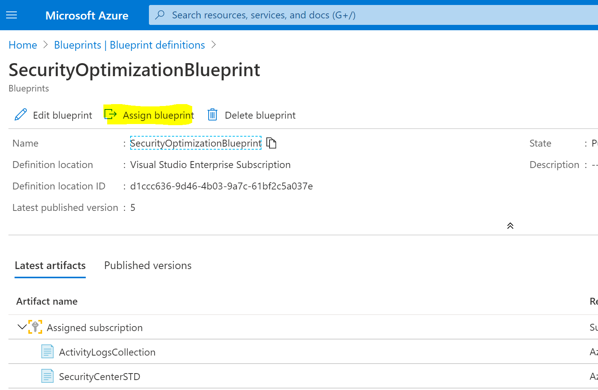
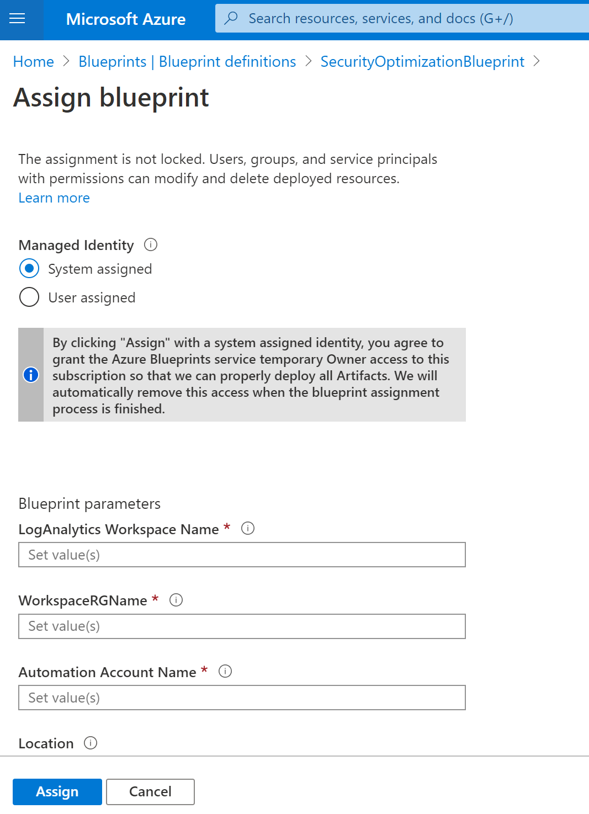
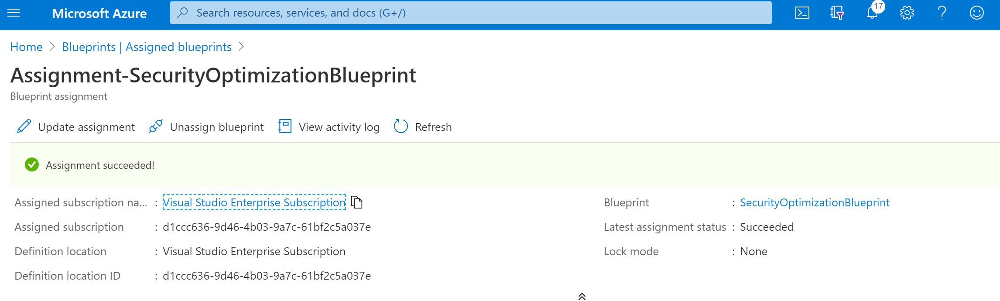

# Deploy Security Optimization Blueprint
To deploy this blueprint you can use Powershell:

**1. Create new blueprint**
```powershell-interactive
Import-Module Az.Blueprint
Connect-AzAccount
Import-AzBlueprintWithArtifact -Name 'SecurityOptimizationBlueprint' -SubscriptionId 'SUBSCRIPTIONID' -InputPath 'c:\SecurityOptBlueprint'
}
```


**2. Publish blueprint**
```powershell-interactive
Import-Module Az.Blueprint
Connect-AzAccount
Import-AzBlueprintWithArtifact -Name 'SecurityOptimizationBlueprint' -SubscriptionId 'SUBSCRIPTIONID' -InputPath 'c:\SecurityOptBlueprint'
}
```

**3. Assign the blueprint to your subscription in the portal**

Go to the blueprint that you have created in the portal and assign it to the subscription, filling the parameters required.
 
 * Go to the blueprint that you have just created.
 <p align="center">
  
</p>
 
  * Assign the blueprint to your subscription.
 <p align="center">
  
</p>

 * Fill in the parameters.
 <p align="center">
  
</p>

  * Wait for the assignment to be succeeded.
 <p align="center">
  
</p>
 
 
 
 
 
 
>  "FastTrack for Azure are “Professional Services” subject to the “Professional Services Terms” in the Online Services Terms and Online Services Data Protection Addendum. This document is provided “AS-IS,” WITHOUT WARRANTY OF ANY KIND. Microsoft disclaims all express, implied or statutory warranties, including warranties of quality, title, non-infringement, merchantability and fitness for a particular purpose. 
